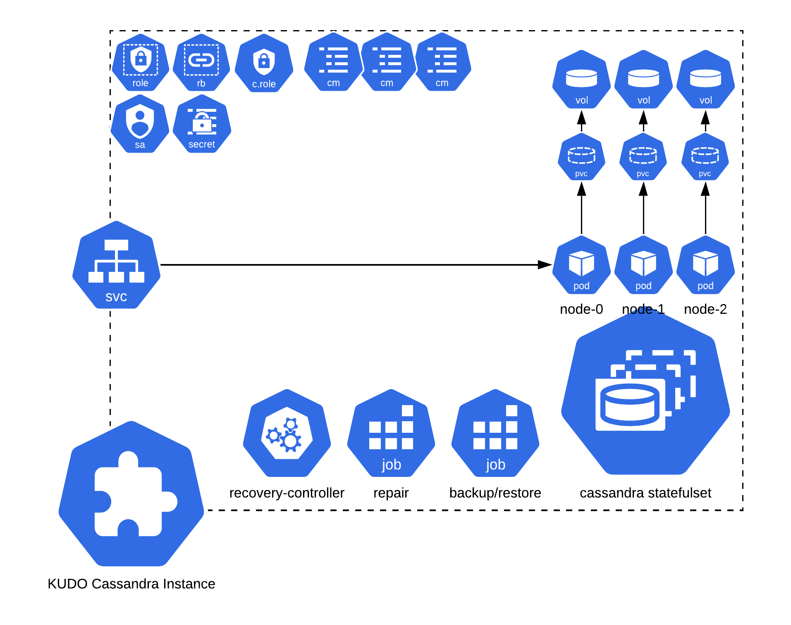
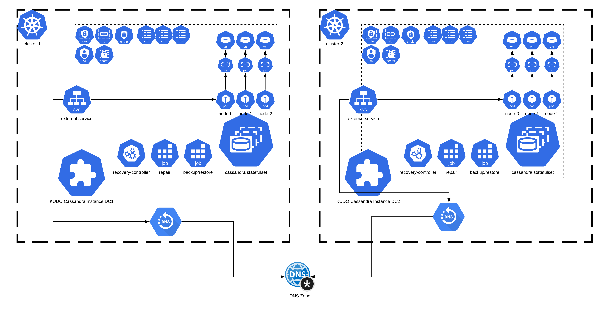

# KUDO Cassandra Architecture

Apache Cassandra is a stateful workload. KUDO Cassandra uses kubernetes
statefulset as the basic piece of the KUDO Cassandra Architecture

As a StatefulSet maintains sticky identities for each of its Pods, this helps
KUDO Cassandra to automate all necessary operations with Apache Cassandra nodes.

To help with updates and upgrades, KUDO Cassandra comes with a custom config
maps thats helps for rolling updates for KUDO Cassandra. Apache Cassandra
maintenance jobs like `repair` and `backup/restore` are configured as kubernetes
jobs and are only deployed on-demand when configuring their respective
parameters.

## Multi-Datacenter Architecture

KUDO Cassandra can span a ring across multiple kubernetes clusters, to
facilitate the deployment across various regions and zones. Read more about
multidataceneter configuration options in the
[multi-dataceneter](./multidataceneter.md) docs.

