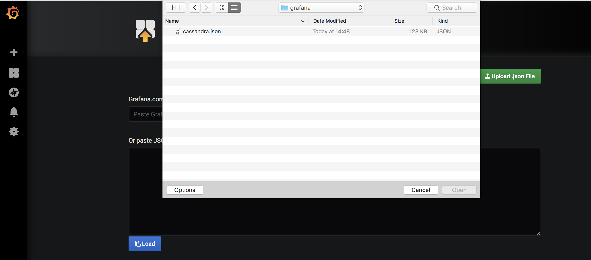

# Monitoring KUDO Cassandra

This guide explains how to set up monitoring for KUDO Cassandra.

## Description

The KUDO Cassandra operator can export metrics to Prometheus. It achieves this
using a Prometheus exporter based on the
[criteo/cassandra_exporter](https://github.com/criteo/cassandra_exporter).

When the `PROMETHEUS_EXPORTER_ENABLED` parameter is set to `true`:

- A `prometheus-exporter` container will run in the same pod as every Cassandra
  `node` container. It will listen for connections on
  `PROMETHEUS_EXPORTER_PORT`, which is set to `7200` by default.
- A `prometheus-exporter-port` will be added to the KUDO Cassandra operator
  [Service](https://kubernetes.io/docs/concepts/services-networking/service/).
- A
  [ServiceMonitor](https://github.com/coreos/prometheus-operator/blob/master/Documentation/user-guides/getting-started.md#related-resources)
  will be created to make Prometheus poll that port for metrics.

## Pre-conditions

- KUDO Cassandra instance running
- [Prometheus operator](https://github.com/coreos/prometheus-operator) and
  [Grafana](https://grafana.com/) set up in the cluster. The
  [kube-prometheus](https://github.com/coreos/kube-prometheus) project provides
  both of them.
- KUDO CLI installed.

The examples below assume that the instance and namespace names are stored in
the following shell variables. With this assumptions met, you should be able to
copy-paste the commands easily.

```bash
instance_name=cassandra
namespace_name=default
```

## Steps

### 1. Make sure that Prometheus Exporter is enabled on the KUDO Cassandra instance

This parameter is `false` by default, so you need to enable it explicitly.

You can check the value of the parameter on a running instance with a command
like:

```bash
kubectl get instance --template '{{.spec.parameters.PROMETHEUS_EXPORTER_ENABLED}}{{"\n"}} $instance_name -n $namespace_name'
```

An output of `<no value>` or `true` means that the exporter is enabled.

_Any other output_ means that the exporter is _disabled_. In that case you need
to enable it with a command such as the following. If you need customization,
see other [parameters](parameters.md) that start with `PROMETHEUS_EXPORTER_`.

```bash
kubectl kudo update -p PROMETHEUS_EXPORTER_ENABLED=true --instance $instance_name -n $namespace_name
```

Expected output:

```text
Instance cassandra was updated.
```

### 2. Install the Grafana dashboard

A sample grafana dashboard is provided in
[the monitoring directory](https://github.com/mesosphere/kudo-cassandra-operator/tree/master/monitoring/grafana).

How you access the Grafana UI depends on how it was installed. Upon accessing
the `/dashboard/import` URI you will be able to upload or copy-paste the
`cassandra.json` file:



Once done, you will be able to see various Cassandra metrics in the dashboard:


### Notes

:warning: Depending on how your prometheus operator was deployed, you may need
to check the `Prometheus` resource. The `serviceMonitorNamespaceSelector` and
`serviceMonitorSelector` attributes on that resource need to be configured to
match the
[labels on the `ServiceMonitor` resource](../operator/templates/service-monitor.yaml#L7)
created by the KUDO Cassandra operator.

The Prometheus exporter container that is run alongside each Cassandra node
requires 1 CPU and 512MiB memory each.

## Custom Configuration

To use the custom
[prometheus exporter configuration](https://github.com/criteo/cassandra_exporter#config-file-example),
we need to create a configmap with the properties we want to override.

Example custom configuration:

```yaml
apiVersion: v1
kind: ConfigMap
metadata:
  name: custom-exporter-configuration
data:
  config.yml: |
    maxScrapFrequencyInSec:
      2000:
        - .*:totaldiskspaceused:.*
```

Create the ConfigMap in the namespace we will have the KUDO Cassandra cluster

```bash
$ kubectl create -f custom-exporter-configuration.yaml -n $namespace_name
configmap/custom-exporter-configuration created
```

Enable the exporter

```bash
kubectl kudo update \
  -p PROMETHEUS_EXPORTER_ENABLED=true \
  -p PROMETHEUS_EXPORTER_CUSTOM_CONFIG_CM_NAME=custom-exporter-configuration \
  --instance $instance_name -n $namespace_name
```

:warning: The following properties are configured internally by the operator and
cannot be overridden using custom configuration:

- host
- listenAddress
- listenPort
- user
- password
- ssl
