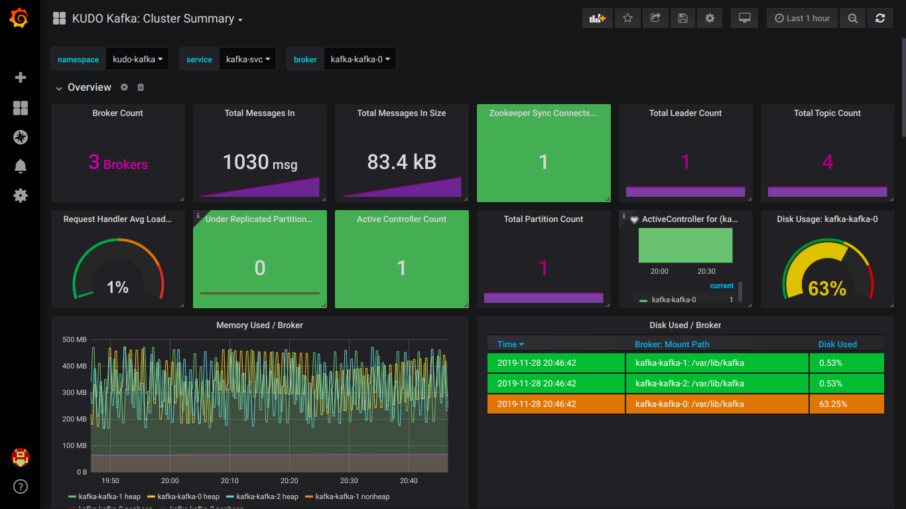

# Monitoring

By default, the KUDO Kafka Operator comes with the JMX Exporter agent enabled. 

When the Kafka operator is deployed with the parameter `METRICS_ENABLED=true` (which defaults to `true`) then:

- Each broker bootstraps with the [JMX Exporter](https://github.com/prometheus/jmx_exporter) java agent exposing the metrics at `9094/metrics`
- Adds a port named `metrics` to the Kafka Service
- Adds a label `kubeaddons.mesosphere.io/servicemonitor: "true"` for the service monitor discovery. 


```
kubectl describe svc kafka-svc
...
Port:              metrics  9094/TCP
TargetPort:        9094/TCP
...
```

### Using the Prometheus Service Monitor

To use the prometheus service monitor, it's necessary to have installed the prometheus operator previously in the cluster.

If Kafka is using the default namespace, we can create a service-monitor with the following:
```
kubectl create -f resources/service-monitor.yaml
```

Upload this [grafana json](./resources/grafana-dashboard.json) and you should see the following Kafka dashboard:



### Disable the JMX Exporter

 ```
kubectl kudo install kafka --instance=kafka --parameter METRICS_ENABLED=false
 ```

