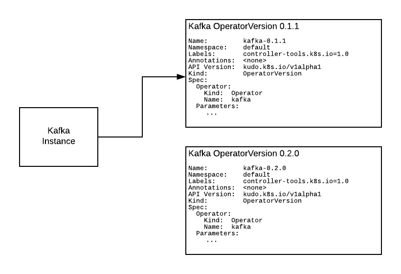
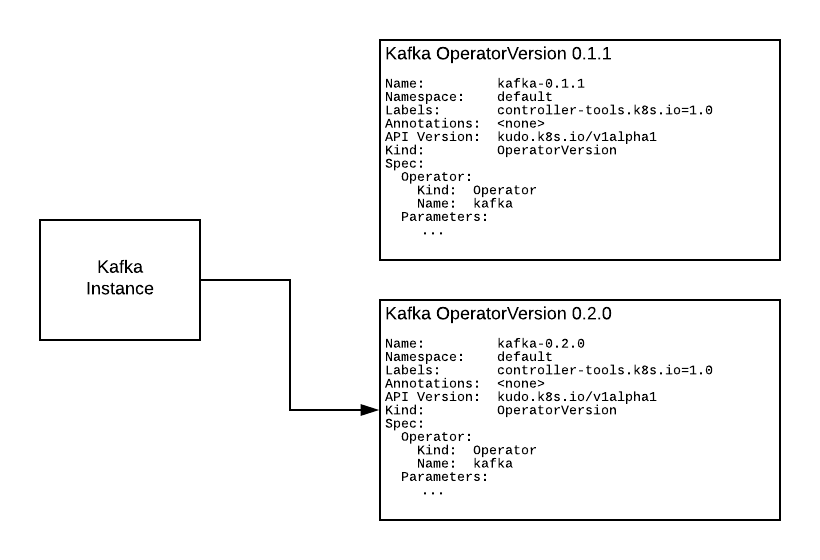

# Upgrading the KUDO Kafka Operator

This document explains the upgrade concepts for KUDO Kafka. To see the full upgrade runbook please check [upgrading KUDO Kafka runbook](./upgrade-kafka.md)

KUDO Kafka upgrades work by linking the Kafka cluster `Instance` object to the correct `operatorVersion` object.

We can have multiple operator versions in the same Kubernetes cluster. 
One instance object represents a Kafka Cluster and multiple instances can use the same or different operator versions.



Upgrading can be done by patching the Kafka Instance that holds all the configuration of a specific Kafka cluster and pointing it to a new OperatorVersion object.



The following upgrade procedure assumes one running Kafka cluster and one Kafka operator version already installed (version `kafka-0.1.2`). It also assumes one is running KUDO 0.5.0 or later:

Check for running instances:

```
$ kubectl get instances
NAME             AGE
kafka-instance   29h
```

We can check the plan status of our Kafka cluster `kafka-instance` with:
```
$ kubectl kudo plan status --instance=kafka-instance
Plan(s) for "kafka-instance" in namespace "kudo-kafka":
.
└── kafka-instance (Operator-Version: "kafka-1.2.0" Active-Plan: "deploy")
    ├── Plan deploy (serial strategy) [COMPLETE], last updated 2020-04-23 13:13:30
    │   └── Phase deploy-kafka (serial strategy) [COMPLETE]
    │       └── Step deploy [COMPLETE]
    ├── Plan mirrormaker (serial strategy) [NOT ACTIVE]
    │   └── Phase deploy-mirror-maker (serial strategy) [NOT ACTIVE]
    │       └── Step deploy [NOT ACTIVE]
    └── Plan not-allowed (serial strategy) [NOT ACTIVE]
        └── Phase not-allowed (serial strategy) [NOT ACTIVE]
            └── Step not-allowed [NOT ACTIVE]
```
**Note:** the operator version is `kafka-1.2.0`

To update the Kafka cluster from version `1.2.0` to `1.2.1`:

```
$ kubectl kudo upgrade kafka --operator-version=1.2.1 --instance kafka-instance

operatorversion.kudo.dev/v1beta1/kafka-1.2.1 created
```
Now there are two operator versions installed:
```
kubectl get operatorversions

NAME              AGE
kafka-1.2.0       31m
kafka-1.2.1       19m
```

Check the plan status again:

```
$ kubectl kudo plan status --instance=kafka-instance
Plan(s) for "kafka-instance" in namespace "kudo-kafka":
.
└── kafka-instance (Operator-Version: "kafka-1.2.1" Active-Plan: "deploy")
    ├── Plan cruise-control (serial strategy) [NOT ACTIVE]
    │   └── Phase cruise-addon (serial strategy) [NOT ACTIVE]
    │       └── Step deploy-cruise-control [NOT ACTIVE]
    ├── Plan deploy (serial strategy) [COMPLETE], last updated 2020-04-23 13:28:12
    │   ├── Phase deploy-kafka (serial strategy) [COMPLETE]
    │   │   ├── Step generate-tls-certificates [COMPLETE]
    │   │   ├── Step configuration [COMPLETE]
    │   │   ├── Step service [COMPLETE]
    │   │   └── Step app [COMPLETE]
    │   └── Phase addons (parallel strategy) [COMPLETE]
    │       ├── Step monitoring [COMPLETE]
    │       ├── Step access [COMPLETE]
    │       ├── Step mirror [COMPLETE]
    │       └── Step load [COMPLETE]
    ├── Plan external-access (serial strategy) [NOT ACTIVE]
    │   └── Phase resources (serial strategy) [NOT ACTIVE]
    │       └── Step deploy [NOT ACTIVE]
    ├── Plan kafka-connect (serial strategy) [NOT ACTIVE]
    │   └── Phase deploy-kafka-connect (serial strategy) [NOT ACTIVE]
    │       ├── Step deploy [NOT ACTIVE]
    │       └── Step setup [NOT ACTIVE]
    ├── Plan mirrormaker (serial strategy) [NOT ACTIVE]
    │   └── Phase app (serial strategy) [NOT ACTIVE]
    │       └── Step deploy [NOT ACTIVE]
    ├── Plan not-allowed (serial strategy) [NOT ACTIVE]
    │   └── Phase not-allowed (serial strategy) [NOT ACTIVE]
    │       └── Step not-allowed [NOT ACTIVE]
    ├── Plan service-monitor (serial strategy) [NOT ACTIVE]
    │   └── Phase enable-service-monitor (serial strategy) [NOT ACTIVE]
    │       └── Step deploy [NOT ACTIVE]
    ├── Plan update-instance (serial strategy) [NOT ACTIVE]
    │   └── Phase app (serial strategy) [NOT ACTIVE]
    │       ├── Step conf [NOT ACTIVE]
    │       ├── Step svc [NOT ACTIVE]
    │       └── Step sts [NOT ACTIVE]
    └── Plan user-workload (serial strategy) [NOT ACTIVE]
        └── Phase workload (serial strategy) [NOT ACTIVE]
            └── Step toggle-workload [NOT ACTIVE]
```

**Note:** the operator-version is now `kafka-1.2.1` meaning the Kafka Operator has been successfully upgraded.

