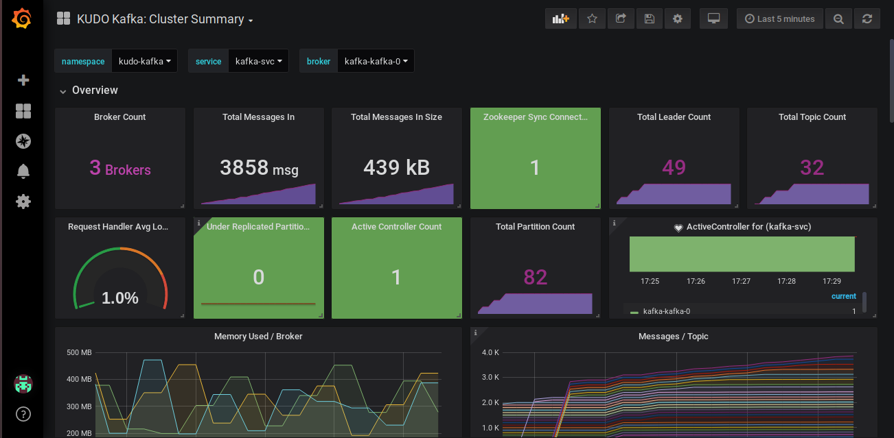

# KUDO Kafka Runbook

## Overview

This runbook helps the user to perform a demonstration to experience user workload generation feature offered by KUDO Kafka.

## Getting Started

To experience KUDO Kafka with some user workload on its brokers, some prerequisites are:
- A running K8s cluster (with at least 3 worker nodes)
- KUDO initialized and configured over the `kubectl`

### Creating a namespace
To isolate our operators from other running installations over the cluster, we prefer to create a separate namespace for them.

Let us create a namespace `kudo-kafka` using:
```
$ kubectl create ns kudo-kafka
```
Sample output of this command:
        `namespace/kudo-kafka created`

## Deploying Zookeeper

KUDO Kafka should be backed by KUDO Zookeeper running in the background. To install KUDO Zookeeper in the namespace `kudo-kafka`:
```
$ kubectl kudo install zookeeper --instance=zk --namespace=kudo-kafka
```

Sample output of this command:
```
operator.kudo.dev/v1beta1/zookeeper created
operatorversion.kudo.dev/v1beta1/zookeeper-0.3.0 created
instance.kudo.dev/v1beta1/zk created
```

You can check for the successful deployment of Zookeeper service through: 
```sh
$ kubectl kudo plan status --instance=zk --namespace=kudo-kafka
Plan(s) for "zk" in namespace "kudo-kafka":
.
└── zk (Operator-Version: "zookeeper-0.3.0" Active-Plan: "deploy")
    ├── Plan deploy (serial strategy) [COMPLETE]
    │   ├── Phase zookeeper [COMPLETE]
    │   │   └── Step deploy (COMPLETE)
    │   └── Phase validation [COMPLETE]
    │       ├── Step validation (COMPLETE)
    │       └── Step cleanup (COMPLETE)
    └── Plan validation (serial strategy) [NOT ACTIVE]
        └── Phase connection (serial strategy) [NOT ACTIVE]
            └── Step connection (serial strategy) [NOT ACTIVE]
                ├── connection [NOT ACTIVE]
                └── cleanup [NOT ACTIVE]
```

Please note that the deployment of Zookeeper will result in a Zookeeper URI address, 
which will be further used to specify about Zookeeper's instance during KUDO Kafka's installation. The URI in `kudo-kafka` namespace can be referred as:
  `zk-zookeeper-0.zk-hs:2181,zk-zookeeper-1.zk-hs:2181,zk-zookeeper-2.zk-hs:2181`

### Deploying KUDO Kafka with dummy user workload

KUDO Kafka can be deployed with some dummy user workload running over Kafka brokers by specifying `RUN_USER_WORKLOAD` parameter as true. 

In order to install KUDO Kafka having user workload in the namespace `kudo-kafka`:
```
$ kubectl kudo install kafka --instance=kafka --namespace=kudo-kafka \
 -p ZOOKEEPER_URI=zk-zookeeper-0.zk-hs:2181,zk-zookeeper-1.zk-hs:2181,zk-zookeeper-2.zk-hs:2181 \
 -p RUN_USER_WORKLOAD=true \
 -p ADD_SERVICE_MONITOR=true
 ```

 Here, some parameters which are specified are described as:
  - `ZOOKEEPER_URI`: Host and Port information for Zookeeper connection.
  - `RUN_USER_WORKLOAD`: Creates some dummy user workload over Kafka brokers.
  - `ADD_SERVICE_MONITOR`: Creates a service monitor for Kafka service.


Sample output of this command:
```
operator.kudo.dev/v1beta1/kafka created
operatorversion.kudo.dev/v1beta1/kafka-1.3.0 created
instance.kudo.dev/v1beta1/kafka created
```

Other than the desired number of three broker pod tasks, this deployment creates two additional pods i.e. producer and consumer that run over brokers to create some dummy workload.
We can check these pod tasks running through this:
```
$ kubectl get pods -w -n kudo-kafka
NAME                                            READY   STATUS    RESTARTS   AGE
kafka-kafka-0                                   1/1     Running   0          4m56s
kafka-kafka-1                                   1/1     Running   0          4m28s
kafka-kafka-2                                   1/1     Running   0          3m51s
kafka-user-workload-consumer-ffbbc6777-w75wj    1/1     Running   0          4m56s
kafka-user-workload-producer-85b647f677-7627j   1/1     Running   0          4m56s
zk-zookeeper-0                                  1/1     Running   0          128m
zk-zookeeper-1                                  1/1     Running   0          128m
zk-zookeeper-2                                  1/1     Running   0          128m
```

To wrap up, here is a summary of commands that should be executed in order to get the KUDO Kafka service up and running, with some dummy user workload present over it:
```
$ kubectl create ns kudo-kafka
$ kubectl kudo install zookeeper --instance=zk --namespace=kudo-kafka
$ kubectl kudo install kafka --instance=kafka --namespace=kudo-kafka \
 -p ZOOKEEPER_URI=zk-zookeeper-0.zk-hs:2181,zk-zookeeper-1.zk-hs:2181,zk-zookeeper-2.zk-hs:2181 \
 -p RUN_USER_WORKLOAD=true \
 -p ADD_SERVICE_MONITOR=true
```

### Visualizing user workload over Grafana

The user workload data can be visualized using the Grafana dashboard. You can create a new Grafana dashboard using [Grafana JSON file](https://github.com/kudobuilder/operators/blob/master/repository/kafka/docs/latest/resources/grafana-dashboard.json)

Sample view of the dashboard:

