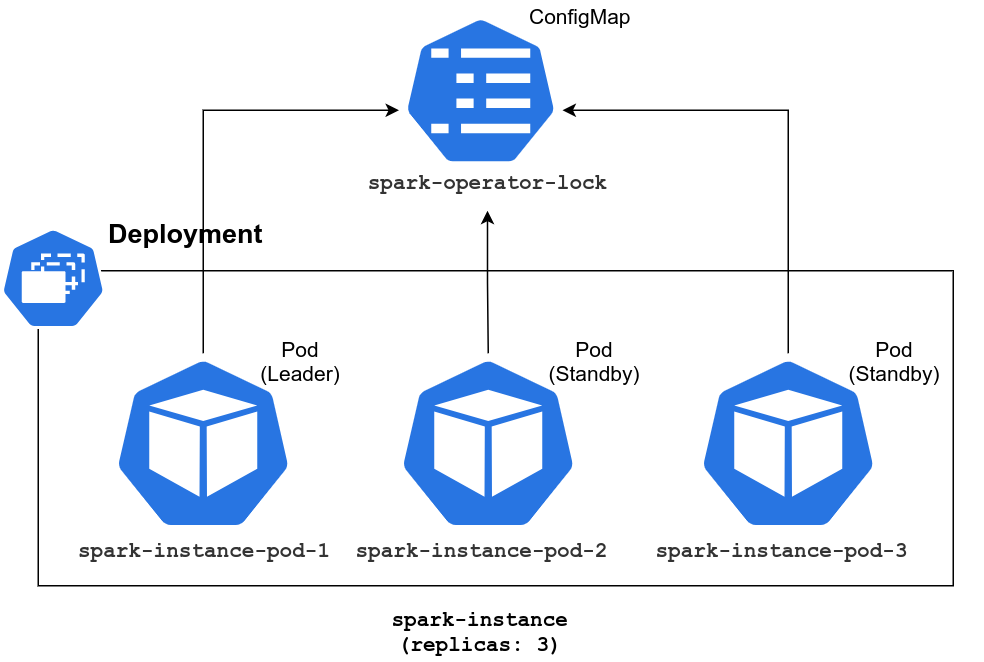

# Advanced configuration options

## Spark Operator high-availability (HA) mode

Spark Operator supports high-availability (HA) deployment mode when more than one replica of operator pod is deployed and [leader election](https://en.wikipedia.org/wiki/Leader_election) is enabled. 

In this mode, only one replica (leader) of operator deployment is actively operating 
(handling updates of resources with kind `SparkApplication` which represent Spark jobs submitted to a cluster), while other replicas are idle.



A leader is selected via the leader election process which initiated at operator’s startup and continuously runs in the background. During that process, all candidates are racing to acquire a lock resource. A candidate first possessed the lock becomes a leader, which then continually send a “heartbeat” requests to renew its position as the leader, and the other candidates periodically make new attempts to become the leader.

**Note:** the leader election process happens within a single installation of KUDO Spark Operator amongst controllers/pods belonging to this KUDO instance, not across all operators installed.

In case the leader replica fails (due to node failure, for example), the leader election process is initiated to select the new leader from available replicas.

Leader election (LE) configuration parameters:

| Parameter Name                | Description                                                                                                                               | Default value    	|
|-----------------------------	|--------------------------------------------------------------------------------------------------------------------------------------------	|---------------------	|
| enableLeaderElection        	| Enable/disable leader election.                                                                                                            	| false               	|
| leaderElectionLockName      	| Name of the lock resource (ConfigMap) used for LE.                                                                                         	| spark-operator-lock 	|
| leaderElectionLockNamespace 	| Namespace of the lock resource used for LE.                                                                                                	| spark-operator      	|
| leaderElectionLeaseDuration 	| The duration that non-leader candidates will wait to force acquire leadership. <br>This is measured against the time of last observed ack. 	| 15s                 	|
| leaderElectionRenewDeadline 	| The duration the acting master will retry refreshing leadership before giving up.                                                          	| 14s                 	|
| leaderElectionRetryPeriod   	| The duration the clients should wait between tries of action.                                                                              	| 4s                  	|

To enable HA mode, the following parameters must be passed to `kudo install` command:
```bash
$ kubectl kudo install spark \
    --namespace=spark-operator \
    -p replicas=3 \
    -p enableLeaderElection=true

```

Verify the deployment and specified number of replicas are running:
```bash
$ kubectl get pods -n spark-operator                  
NAME                          	READY   STATUS  	RESTARTS   AGE
spark-instance-5c8b54d7fd-gq4xh   1/1     Running 	0      	15m
spark-instance-5c8b54d7fd-t7fbq   1/1     Running 	0      	15m
spark-instance-5c8b54d7fd-wcm66   1/1     Running 	0      	15m
spark-instance-init-6nwcx     	0/1     Completed   0      	15m
spark-pi-driver               	0/1     Completed   0      	90s
```

Information about the current leader instance stored in ConfigMap resource:
```bash
$ kubectl get configmaps spark-operator-lock -o yaml -n spark-operator
apiVersion: v1
kind: ConfigMap
metadata:
  annotations:
    control-plane.alpha.kubernetes.io/leader: 
'{"holderIdentity":"spark-instance-5c8b54d7fd-t7fbq","leaseDurationSec
onds":15,
        "acquireTime":"2019-12-16T13:13:26Z","renewTime":"2019-12-17T08:38:03Z
","leaderTransitions":0}'
  creationTimestamp: "2019-12-16T12:57:26Z"
  name: spark-operator-lock
  namespace: spark
  resourceVersion: "598116"
  selfLink: 
/api/v1/namespaces/spark-operator/configmaps/spark-operator-lock
  uid: 40d1b369-3384-42d0-b585-5565c4b08c97
```

Observe pods logs to check the leader election process is working and the leader has been elected:
```bash
$ kubectl logs spark-instance-5c8b54d7fd-t7fbq -n spark-operator
...
I1212 14:41:26.988989      10 main.go:206] Waiting to be elected 
leader before starting application controller goroutines
I1212 14:41:27.011785      10 leaderelection.go:214] successfully 
acquired lease spark-operator/spark-operator-lock
...

```

## Using Volcano as a Batch Scheduler

Volcano is a batch scheduling system built on Kubernetes. It provides a suite of mechanisms that are commonly required by many classes of batch & elastic workloads including distributed data processing and machine learning. Spark Operator can be integrated with Volcano to get fine-grained control of Spark applications scheduling via queues and priority classes. To get more information about the Volcano system and how to install it on your K8s cluster, visit [https://volcano.sh/](https://volcano.sh/).

To enable the batch scheduler (disabled by default), install Spark Operator with the following parameter:

```bash
$ kubectl kudo install spark \
    --namespace=spark-operator \
    -p enableBatchScheduler=true
```
In `SparkApplication` yaml file, add the following parameter to the `spec` section:
```
apiVersion: "sparkoperator.k8s.io/v1beta2"
kind: SparkApplication
metadata:
  name: <Spark application name>
  namespace: <Spark application namespace>
spec:
  batchScheduler: "volcano"
  <the rest of the configuration>
```
After the application is submitted, verify the driver pod is scheduled by Volcano:

```bash
$ kubectl describe spark-pi-driver -n spark-operator
...
Events:
  Type     Reason       Age   From               Message
  ----     ------       ----  ----               -------
  Normal   Scheduled    76s   volcano            Successfully assigned spark-operator/spark-pi-driver to <node-name>
...
```
