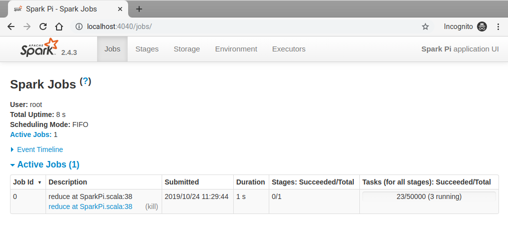
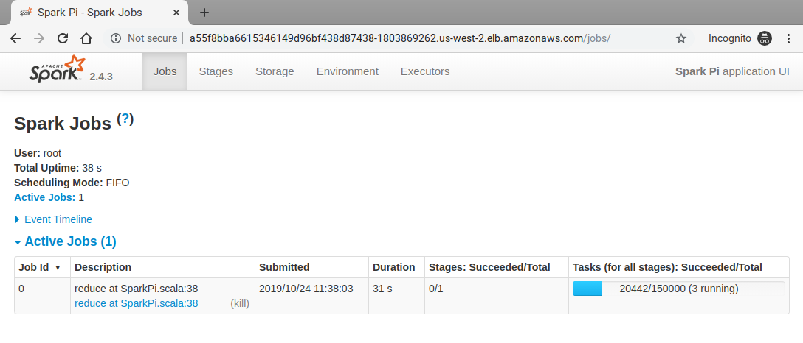

# Submitting Spark Applications

#### Prerequisites

- kubectl 
- KUDO Spark installed (please refer to the [Installation](installation.md))

In order to deploy a Spark Application to Kubernetes using the KUDO Spark Operator, it should be described as a Kubernetes object. To do that, create a specification in `yaml` format with all the necessary configuration required for the application.

Let's take a simple `SparkPi` application as an example. The `yaml` specification could be found here: [spark-pi.yaml](resources/spark-pi.yaml)

```yaml
apiVersion: "sparkoperator.k8s.io/v1beta2"
kind: SparkApplication
metadata:
  name: spark-pi
  namespace: spark
spec:
  type: Scala
  mode: cluster
  image: "mesosphere/spark:spark-2.4.5-hadoop-2.9-k8s"
  imagePullPolicy: Always
  mainClass: org.apache.spark.examples.SparkPi
  mainApplicationFile: "local:///opt/spark/examples/jars/spark-examples_2.11-2.4.5.jar"
  arguments:
    - "150000"
  sparkConf:
    "spark.ui.port": "4041"
  sparkVersion: "2.4.5"
  restartPolicy:
    type: Never
  driver:
    cores: 1
    memory: "512m"
    labels:
      version: 2.4.5
    serviceAccount: spark-driver
  executor:
    cores: 1
    instances: 2
    memory: "512m"
    labels:
      version: 2.4.5
```

Basically, all the Spark application configuration is placed under `spec` section. Here you can specify Spark related configuration properties, such as number of executors, number of cores for drivers/executors, amount of memory, etc. There is also a `sparkConf` section, where you can place configuration parameters in the form of key-value pairs. In this example, we override the default `spark.ui.port` with a custom value.

#### Creating the application

After the application spec is ready, the following command can be used to submit it to the operator:

```
$ kubectl create -f ./resources/spark-pi.yaml
```
You can list all Spark applications with the following command:
```bash
$ kubectl get sparkapplications -n spark
NAME       AGE
spark-pi   1m
```

In the example above `-n` flag specifies the namespace where the application is deployed. 

To describe the `spark-pi` application, use the following command:
```bash
$ kubectl describe sparkapplications spark-pi -n spark
```

To get the list of pods:
```bash
$ kubectl get pods -n spark
NAME                                  READY   STATUS      RESTARTS   AGE
spark-gq4bf8-spark-867b8c8d79-btt4q   1/1     Running     0          58m
spark-gq4bf8-spark-init-cdcrn         0/1     Completed   0          58m
spark-pi-1571911449587-exec-1         1/1     Running     0          4s
spark-pi-1571911449587-exec-2         1/1     Running     0          4s
spark-pi-driver                       1/1     Running     0          11s
```
From the output above we can see the application has been created and is currently running as three pods: one driver and two executors.

To see pod's logs, use:
```
$ kubectl logs -f spark-pi-driver -n spark
```
Get the last `n` lines of pod's log:
```
$ kubectl logs --tail=n spark-pi-driver -n spark
```
You can get the full description of the driver pod with the following command: 
```
$ kubectl describe pod spark-pi-driver -n spark
```
Verify the driver pod has completed successfully:
```bash
$ kubectl logs --tail=20 spark-pi-driver -n spark | grep 'Pi is'
Pi is roughly 3.141644502283289
```

#### Configuring Logging
Logging can be configured by placing a custom `log4j.properties` file to `SPARK_CONF_DIR` directory.
Spark Operator provides a mechanism for mounting Spark configuration files via K8s `ConfigMap` objects.

1) Create a `ConfigMap` using the following `log4j.properties` as an example:
```bash
$ cat <<'EOF'>> log4j.properties
log4j.rootCategory=DEBUG, console
log4j.appender.console=org.apache.log4j.ConsoleAppender
log4j.appender.console.target=System.err
log4j.appender.console.layout=org.apache.log4j.PatternLayout
log4j.appender.console.layout.ConversionPattern=%d{yy/MM/dd HH:mm:ss} %p %c{1}: %m%n    
EOF
```
```bash
$ kubectl create configmap spark-conf-map --from-file log4j.properties
```
2) Then, add the following lines to `SparkApplication` spec:
```yaml
apiVersion: "sparkoperator.k8s.io/v1beta2"
kind: SparkApplication
metadata:
  name: spark-pi
  namespace: spark
spec:
...
    sparkConfigMap: spark-conf-map
    ...
    executor:
      javaOptions: "-Dlog4j.configuration=file:/etc/spark/conf/log4j.properties"
```
The contents of `spark-conf-map` will be placed under `/etc/spark/conf` directory for driver and executor pods, 
and `SPARK_CONF_DIR` environment variable will be set to this directory.

#### Updating the application

Let's say you want to update the application and increase the number of executors from 2 to 4. 
To do so, you need to modify the spec file and update the value of `spec.worker.instances`. 

Save the changes and apply the updated spec using the following command:
```bash
$ kubectl apply -f ./resources/spark-pi.yaml -n spark
```

Now let's verify the number of executors has changed:
```bash
$ kubectl get pods -n spark | grep spark-pi             
spark-pi-1571999377454-exec-1         1/1     Running     0          118s
spark-pi-1571999377454-exec-2         1/1     Running     0          118s
spark-pi-1571999377454-exec-3         1/1     Running     0          117s
spark-pi-1571999377454-exec-4         1/1     Running     0          117s
spark-pi-driver                       1/1     Running     0          2m4s
```

#### Deleting the application

You can delete the application with the following command:
```bash
$ kubectl delete sparkapplication spark-pi -n spark
```
This will delete all the pods and services related to the application.

### Accessing Spark UI

When running Spark applications on K8s, it could be useful to have an access to Spark UI to monitor and inspect Spark job executions in a web browser. 

The are a few ways to expose Spark UI for you application. 

When an application is submitted to Kubernetes, the operator automatically creates a `Service` with default type `ClusterIP`, which can be used to access Spark UI externally.
   
```bash
$ kubectl get svc -n spark --field-selector metadata.name=spark-pi-ui-svc
NAME                                  TYPE        CLUSTER-IP    EXTERNAL-IP   PORT(S)             AGE
spark-pi-ui-svc                       ClusterIP   10.0.5.197    <none>        4041/TCP            7s
```

#### Using Port Forwarding

Port forwarding works in a way that connections made to a local port are forwarded to port of the pod which is running the Spark driver. With this connection in place, you can use your local workstation to access Spark UI which is running in the Driver pod.

Command example:
```
$ kubectl port-forward <resource-name> <local-port>:<container-port>
```

In case with `spark-pi` application, the command will look like the following:
```bash
$ kubectl port-forward spark-pi-driver 4040:4041 -n spark
Forwarding from 127.0.0.1:4040 -> 4041
Forwarding from [::1]:4040 -> 4041

```
After that the Spark UI should be available via URL: [localhost:4040](localhost:4040):



#### Using a Service

From the K8s documentation: 

"When creating a service, you have the option of automatically creating a cloud network load balancer. This provides an externally-accessible IP address that sends traffic to the correct port on your cluster nodes provided your cluster runs in a supported environment and is configured with the correct cloud load balancer provider package."

So now let's create a service with special type that will expose our Spark UI globally via cloud network LB.

Service specification can look like the following:  
```yaml
apiVersion: v1
kind: Service
metadata:
  labels:
    app: spark-pi-loadbalancer
  name: spark-pi-loadbalancer
spec:
  type: LoadBalancer
  selector:
    spark-role: driver
  ports:
    - protocol: TCP
      port: 80
      targetPort: 4041
```

Specifying `spark-role: driver` as a `selector` is basically the mechanism for our service to target the required pod.

Create the service using `kubectl create -f ./resources/spark-pi-service.yaml -n spark`. Wait a few minutes and check the services output to verify our new service is now having an `EXTERNAL-IP` assigned: 

```bash
$ kubectl get svc -n spark --field-selector metadata.name=spark-pi-loadbalancer
NAME                    TYPE           CLUSTER-IP   EXTERNAL-IP                                                               PORT(S)        AGE
spark-pi-loadbalancer   LoadBalancer   10.0.3.19    a55f8bba6615346149d96bf438d87438-1803869262.us-west-2.elb.amazonaws.com   80:31917/TCP   10m
```

Now you can use `a55f8bba6615346149d96bf438d87438-1803869262.us-west-2.elb.amazonaws.com` address in your browser to access Spark UI:



Spark UI provides valuable insights into various aspects of an application, but its main drawback is that it's only available for the duration of the application. If you want to be able to explore an application's UI after it's finished, consider setting up the [Spark History Server](history-server.md).

You also might want to consider setting up a complete monitoring solution to be able to visualize and analyze your Spark cluster performance using real-time metrics and dashboards. To do so, please refer to the [Monitoring](monitoring.md) section of the documentation. 
