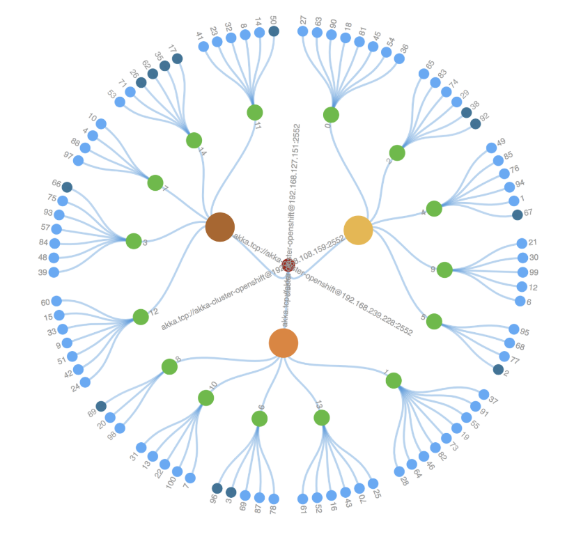
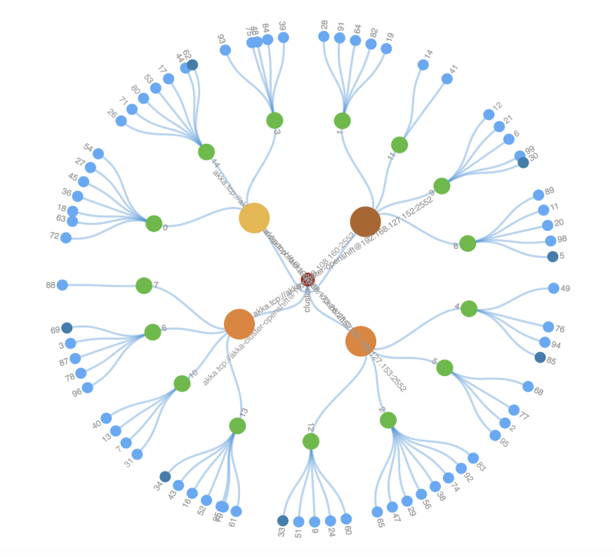
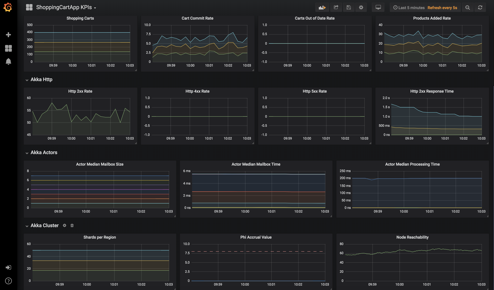
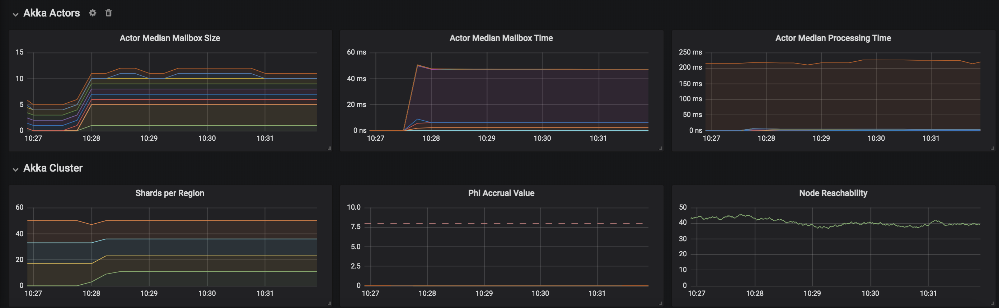

# kudo-akka

This demo kudo operator project is intended to introduce a method for deploying Akka (https://akka.io/) using the Kudo operator framework. It provides examples that can be used as templates for Akka open source or Lightbend Platform enabled,  instrumented Akka deployments that can be monitored by the Lightbend console.  They borrow heavily from both Hugh McKee's [Akka visualization](https://github.com/mckeeh3/akka-java-cluster-kubernetes), and the lightbend cluster behavior [sample apps](https://github.com/lightbend/lb-demos). 


* [operator demos](#operator-demos)
* [create an operator for your akka application](#create-an-operator-for-your-akka-application)

## operator demos

Before we can get started we need to install the `Kudo kubectl CLI plugin`. On `Mac OS X` you can install it using `brew`.

```
brew tap kudobuilder/tap
brew install kudo-cli
```

Once you have a running `kubernetes` cluster with `kubectl` installed along with the `Kudo CLI plugin`, you can install Kudo as follows.

```
kubectl kudo init
```

Next clone the `kudo-akka repository` so that we can install the operator demos.

```
git clone https://github.com/realmbgl/kudo-akka
```

### basic akka demo

This [Akka Cluster](https://doc.akka.io/docs/akka/current/index-cluster.html) demo provides a simplified visualization of [Cluster Sharding](https://doc.akka.io/docs/akka/current/cluster-sharding.html) running in a Kubernetes cluster.

The source code for the `akka cluster` used in this demo can be found [here](https://github.com/mckeeh3/akka-java-cluster-kubernetes).

#### install the cluster

Change to the `operator` folder of the `kudo-akka` repository.

```
cd kudo-akka/operator
```

Use the Kudo cli to `install` the `akka cluster`.

```
kubectl kudo install . --instance myakka
```

#### access the cluster

Use kubectl to get the `ExternalIP` for the akka cluster.

```
kubectl get service
```

In your browser use `http://<external-ip>:8080/`. Note it will take a moment for that link to become active after which you will see the following cluster visualization. The way to read the visulization is `pods` (Orange/Yellow), `shards` (Green), `entities` (blue).



#### scale the cluster

Use the Kudo cli to `scale` the `akka cluster`, we increase the `NODE_COUNT` from 3 to 4.

```
kubectl kudo update --instance myakka -p NODE_COUNT=4
```



### shoppingcart akka demo

The `shoppingcart akka cluster` models client shopping sessions, where customers browse the product catalog, add products to their shopping carts, and ultimately commits the shopping transaction. It uses akka-http, akka-cluster, cluster-sharding, cluster-singleton, Lightbend Telemetry, and the Lightbend Console.

The source code for the `shoppingcart akka cluster` used in this demo can be found [here](https://github.com/lightbend/lb-demos/tree/master/shoppingcartapp).

#### install the cluster

Change to the `operator-shoppingcart` folder of the `kudo-akka` repository.

```
cd kudo-akka/operator-shoppingcart
```

Use the Kudo cli to `install` the `akka cluster`.

```
kubectl kudo install . --instance sc
```

**Note:** This requires a running [Lightbend Console](https://docs.d2iq.com/ksphere/konvoy/partner-solutions/lightbend/) to view telemetry. See the [demo git repo](https://github.com/lightbend/lb-demos) for the relevant grafana dashboard and the shoppingcart sample architecture.

The following shows the `grafana dashboard` for the `shoppingcart akka cluster`.



#### scale the cluster

Use the Kudo cli to `scale` the `akka cluster`, we increase the `NODE_COUNT` from 3 to 4.

```
kubectl kudo update --instance sc -p NODE_COUNT=4
```

You can see how the shards now get distributed over 4 nodes/regions.




## create an operator for your akka application

* copy the `operator folder` from this github repository
* replace `templates/deployment.yaml` and `templates/service.yaml` with the ones for your akka application
* template the `namespace setting`
* template `parameter settings`, making your akka application configurable through `params.yaml`
